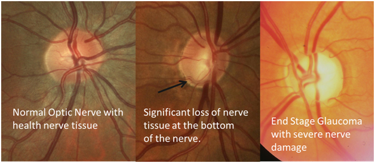
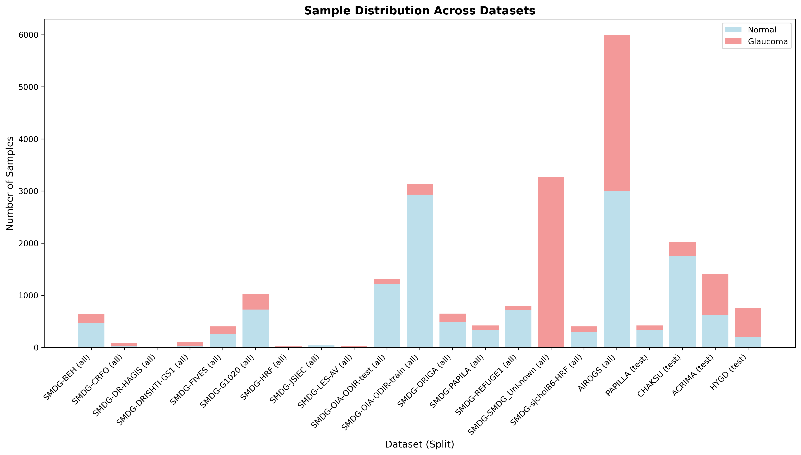
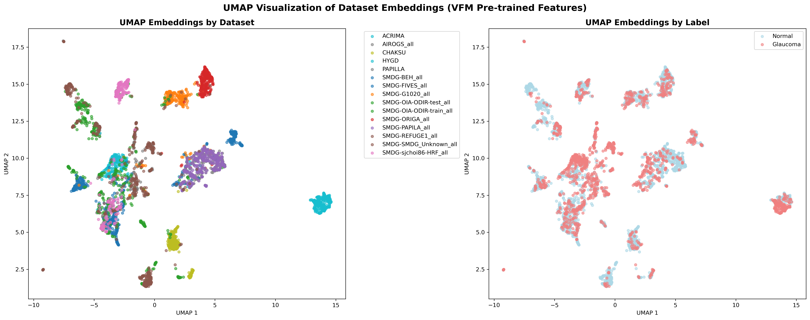
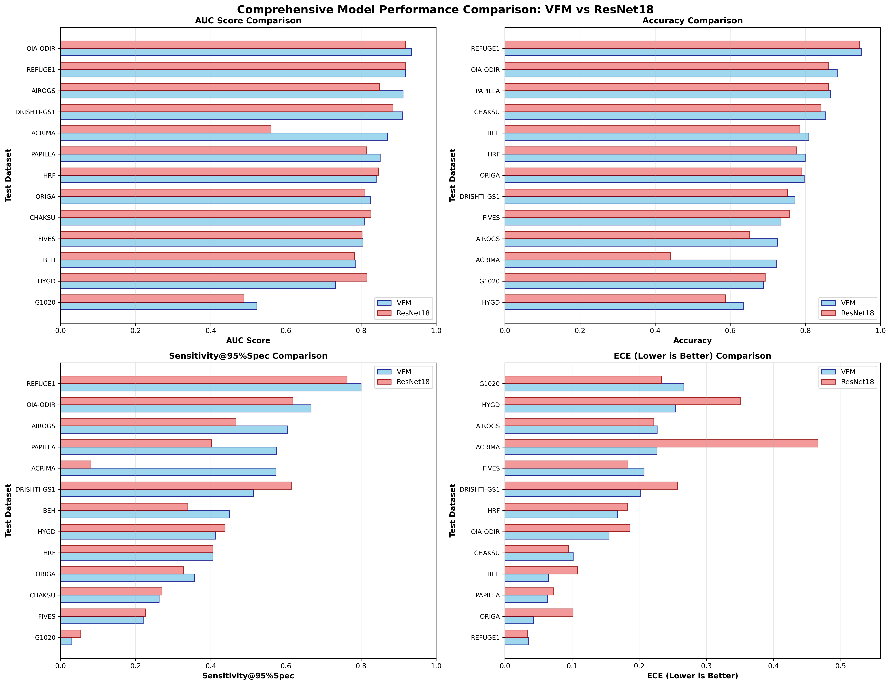

# Multi-Source Domain Adaptation for Glaucoma Classification

## Abstract

This repository presents a framework for multi-source domain adaptation in automated glaucoma detection from fundus photography. Our approach addresses the critical challenge of domain shift across different imaging devices, demographics, and clinical settings by leveraging Vision Foundation Models (VFM) pre-trained with self-supervised learning, using multi-source domain fine-tuning and implementing domain adaptation techniques.

## 1. Introduction to Glaucoma

### 1.1 Clinical Background

Glaucoma is a group of progressive optic neuropathies characterized by irreversible retinal ganglion cell death and visual field defects. It represents the leading cause of irreversible blindness worldwide, affecting over 76 million people globally. The insidious nature of glaucoma, often progressing asymptomatically in early stages, makes early detection crucial for preventing vision loss.

### 1.2 Fundus Photography in Glaucoma Detection

Fundus photography provides a non-invasive method for examining the optic nerve head, allowing clinicians to assess:

- **Cup-to-Disc Ratio (CDR)**: The ratio between the optic cup and optic disc areas, a key indicator of glaucomatous damage
- **Neuroretinal Rim**: Thinning or notching patterns indicative of neural tissue loss
- **Retinal Nerve Fiber Layer (RNFL)**: Changes in thickness and appearance
- **Vascular Changes**: Alterations in retinal blood vessel patterns



Source: [pfecbackoffice.info](https://pfecbackoffice.info/eye-encyclopedia/glaucoma/)*

### 1.3 Challenges in Automated Glaucoma Detection

Traditional machine learning approaches face significant challenges in clinical deployment:

1. **Domain Shift**: Performance degradation when models encounter data from different sources
2. **Device Heterogeneity**: Variations in imaging equipment, protocols, and image quality
3. **Demographic Bias**: Unequal performance across different population groups
4. **Limited Generalizability**: Poor performance on out-of-distribution test sets

## 2. Open-Source Datasets

Our framework leverages multiple publicly available datasets to ensure robust training and comprehensive evaluation:



*Figure: Distribution of samples across different datasets used in our multi-source domain adaptation framework, showing the diversity in data sources and class balance.*

## 3. Vision Foundation Model (VFM) Architecture

### 3.1 Foundation Model Overview

Our approach is built upon Vision Foundation Models (VFMs), specifically designed for medical imaging applications. VFMs represent a paradigm shift from traditional supervised learning by leveraging self-supervised pre-training on large-scale unlabeled datasets.

**Implementation**: This work utilizes the VisionFM model developed by the ABILAB at CUHK. For detailed model architecture, pre-training methodology, and implementation details, please refer to the official repository: [VisionFM GitHub](https://github.com/ABILab-CUHK/VisionFM/tree/main).

### 3.2 Self-Supervised Learning (SSL) Pre-training

The VFM employed in this work utilizes advanced SSL techniques:

#### 3.2.1 Pre-training Methodology
- **Architecture**: Vision Transformer (ViT) Base with Patch16 configuration
- **Pre-training Data**: Large corpus of unlabeled fundus images
- **SSL Objective**: Masked image modeling and contrastive learning
- **Feature Learning**: Robust representation learning without manual annotations

#### 3.2.2 Advantages of SSL for Medical Imaging
1. **Reduced Annotation Dependency**: Leverages abundant unlabeled medical images
2. **Rich Feature Representations**: Learns generalizable visual patterns
3. **Transfer Learning**: Strong initialization for downstream tasks
4. **Domain Robustness**: Better handling of domain variations

## 4. Domain Adaptation Techniques



*Figure: UMAP visualization of learned embeddings showing how feature representations cluster by dataset rather than class, highlighting the significant impact of domain shift on feature distribution. This demonstrates the critical need for domain adaptation techniques.*

Our framework implements a comprehensive suite of domain adaptation methods to address distribution shift and improve generalization:

### 4.1 Domain Adversarial Neural Networks (DANN)

#### 4.1.1 Theoretical Foundation
DANN implements the principle of domain-invariant feature learning through adversarial training:

```
min_θf,θy max_θd L_y(D_s, θf, θy) - λ L_d(D_s ∪ D_t, θf, θd)
```

Where:
- `θf`: Feature extractor parameters
- `θy`: Label classifier parameters  
- `θd`: Domain classifier parameters
- `L_y`: Classification loss on source domain
- `L_d`: Domain classification loss
- `λ`: Domain adaptation weight

#### 4.1.2 Implementation Details

**Gradient Reversal Layer (GRL)**:
```python
class GradientReversalFunction(Function):
    @staticmethod
    def forward(ctx, x, alpha):
        ctx.alpha = alpha
        return x.view_as(x)
    
    @staticmethod
    def backward(ctx, grad_output):
        return grad_output.neg() * ctx.alpha, None
```

**Domain Classifier Architecture**:
```
Domain Classifier:
├── Input: 768-dimensional features from VFM
├── Hidden Layer 1: Linear(768, 256) + ReLU + Dropout(0.2)
├── Hidden Layer 2: Linear(256, 128) + ReLU + Dropout(0.2)
└── Output: Linear(128, num_domains)
```

#### 4.1.3 Training Dynamics
- **Adversarial Weight Schedule**: `λ = 2/(1+exp(-10*p)) - 1` where `p` is training progress
- **Balanced Optimization**: Simultaneous minimization of classification loss and maximization of domain confusion
- **Convergence Monitoring**: Domain classifier accuracy should approach random chance

### 4.2 MixStyle Domain Generalization

#### 4.2.1 Mechanism
MixStyle addresses domain shift by mixing feature statistics across different domains during training:

```python
def mixstyle_forward(self, x):
    if not self.training or torch.rand(1) > self.p:
        return x
    
    B = x.size(0)
    mu = x.mean(dim=[2, 3], keepdim=True)
    var = x.var(dim=[2, 3], keepdim=True)
    sig = (var + self.eps).sqrt()
    
    # Mix statistics
    perm = torch.randperm(B)
    lam = Beta(self.alpha, self.alpha).sample()
    
    mu_mix = lam * mu + (1 - lam) * mu[perm]
    sig_mix = lam * sig + (1 - lam) * sig[perm]
    
    return sig_mix * (x - mu) / sig + mu_mix
```

#### 4.2.2 Benefits
- **Style Augmentation**: Increases diversity of feature statistics
- **Domain Invariance**: Reduces dependence on domain-specific style information
- **Simple Integration**: Easy to incorporate into existing architectures
- **Complementary to DANN**: Can be used alongside adversarial training

### 4.3 Stochastic Weight Averaging (SWA)

#### 4.3.1 Mathematical Foundation
SWA computes running averages of model weights during training:

```
θ_SWA = (1/n) * Σ(i=1 to n) θ_i
```

#### 4.3.2 Implementation
```python
class StochasticWeightAveraging:
    def update(self, epoch):
        if epoch >= self.swa_start and (epoch - self.swa_start) % self.swa_freq == 0:
            if self.swa_n == 0:
                # Initialize SWA state
                for name, param in self.model.named_parameters():
                    self.swa_state[name] = param.data.clone()
            else:
                # Update running average
                for name, param in self.model.named_parameters():
                    self.swa_state[name] += (param.data - self.swa_state[name]) / (self.swa_n + 1)
            self.swa_n += 1
```

#### 4.3.3 Advantages
- **Improved Generalization**: Reduces overfitting through weight averaging
- **Stable Convergence**: Smoother loss landscapes
- **Better Calibration**: Improved confidence estimation

### 4.4 Test-Time Adaptation (TTA)

#### 4.4.1 Entropy Minimization
TTA adapts model parameters at inference time using unlabeled test samples:

```python
def test_time_adapt(self, x):
    # Forward pass
    logits = self.model(x)
    probs = F.softmax(logits, dim=1)
    
    # Entropy loss
    entropy = -torch.sum(probs * torch.log(probs + 1e-8), dim=1)
    loss = entropy.mean()
    
    # Backward pass and parameter update
    loss.backward()
    self.optimizer.step()
    
    return logits
```

#### 4.4.2 Benefits
- **Online Adaptation**: Adapts to target domain during inference
- **Unsupervised**: Requires no labeled target data
- **Complementary**: Works alongside other DA techniques

### 4.5 Multi-Source Training Strategy

#### 4.5.1 Leave-One-Dataset-Out (LODO) Evaluation
- **Training**: Combine multiple source datasets
- **Testing**: Evaluate on held-out target dataset

#### 4.5.2 Weighted Sampling
- **Balanced Representation**: Equal sampling from each source domain
- **Class Balance**: Maintain class distribution across domains
- **Implementation**: Custom data loader with domain-aware sampling

## 5. Experimental Framework

### 5.1 Training Configuration

#### 5.1.1 Model Setup
- **Base Architecture**: ViT-Base-Patch16-224
- **Pre-trained Weights**: VFM_Fundus_weights.pth
- **Input Resolution**: 224×224 pixels

#### 5.1.2 Optimization
- **Optimizer**: AdamW with weight decay (1e-4)
- **Learning Rate**: 1e-5 for VFM (with LLRD)
- **Scheduler**: ReduceLROnPlateau with patience
- **Early Stopping**: 10 epochs patience on validation loss

#### 5.1.3 Data Augmentation
- **Standard Augmentation**: RandomResizedCrop, RandomHorizontalFlip, ColorJitter
- **Advanced Techniques**: MixUp, CutMix, RandAugment
- **Normalization**: ImageNet statistics adapted for fundus images

### 5.2 Evaluation Metrics



*Figure: Comprehensive comparison between VFM (Vision Foundation Model) and ResNet18 architectures across multiple evaluation metrics including AUC, Expected Calibration Error (ECE), and other performance indicators. This comparison demonstrates the superior performance and calibration quality of the VFM approach.*

#### 5.2.1 Classification Performance
- **Area Under Curve (AUC)**: Primary performance metric
- **Sensitivity at 95% Specificity**: Clinically relevant threshold
- **Balanced Accuracy**: Accounts for class imbalance
- **F1-Score**: Harmonic mean of precision and recall

#### 5.2.2 Calibration Assessment
- **Expected Calibration Error (ECE)**: Reliability of confidence estimates
- **Brier Score**: Proper scoring rule for probabilistic predictions
- **Reliability Diagrams**: Visual assessment of calibration quality
